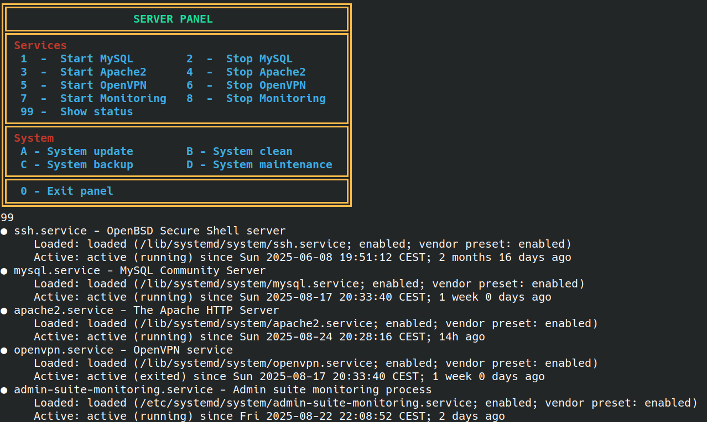

# X-PANEL
The bash panel script for automating server processes.

## Preview

## License
The project is open-sourced software licensed under the [MIT license](https://github.com/lukasbecvar/x-panel/blob/main/LICENSE)
